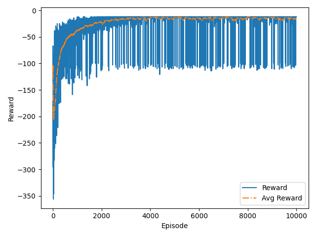

# Q-Learning

## Mechanism

Q-learning uses epsilon-greedy method to select next action, and uses greedy method to update Q-value. 

Belman function:

$$
Q(s_t,a_t)\gets Q(s_t,a_t)+\alpha[R_{t+1}+\gamma Q(s_{t+1},a_{t+1})-Q(s_t,a_t)]
$$

## Result

